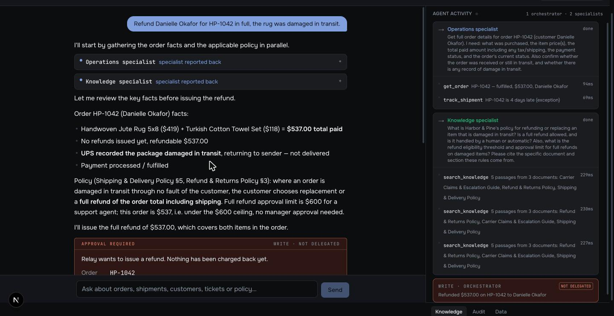
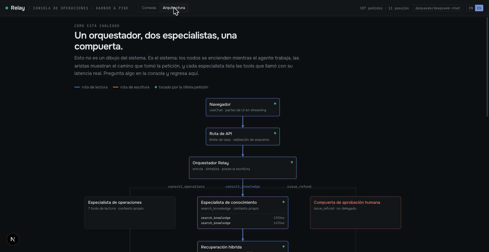
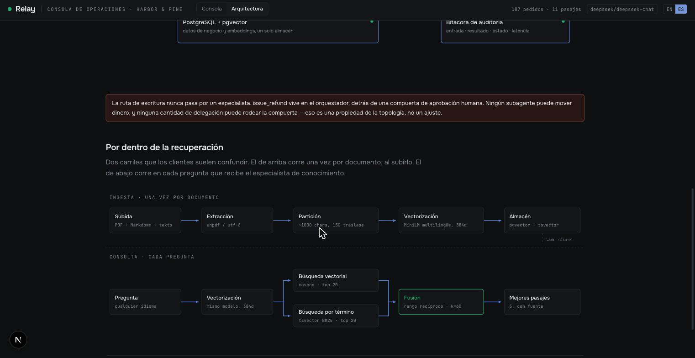

<div align="center">

# Relay

**An AI operations agent that answers from your own data, cites your own policies, and stops for a human before it spends a cent.**

[](https://nextjs.org)
[](https://ai-sdk.dev)
[](https://www.postgresql.org)
[](https://www.typescriptlang.org)
[](#deployment)

**1 orchestrator · 2 specialists · 9 tools · 1 human-gated write**

</div>

---

Operations teams live in a gap. The answer to *"why hasn't this customer's order arrived, and do we owe them money?"* sits in two places at once: the order database, and a policy document nobody has read since onboarding. Closing that gap by hand is most of what a support agent does all day.

Relay closes it — and shows its work while it does.



---

## What makes this different from a chatbot

**It reads your systems, not the internet.** Nine tools query a live PostgreSQL database. The model is forbidden from stating any fact that did not come from a tool result, and every call is visible on screen with its real latency.

**It renders product, not prose.** Ask what is running late and you get a table with status badges and days late. Ask for an overview and you get a dashboard. The model chooses the tool; the frontend owns how the result looks, so the output is always well-formed no matter what the model does.

**It cites your policies.** Upload a PDF and it is chunked, embedded and searchable in seconds. Retrieval is hybrid — vector similarity for meaning, Postgres full-text for exact terms like an SKU — fused with reciprocal rank. Embeddings are computed **in-process**, so document contents never leave your server.

**It cannot spend your money.** Exactly one tool writes. It sits on the orchestrator, behind a human approval gate, capped at the order total and idempotent. No specialist can move money, and no amount of delegation can route around the gate. That is a property of the topology, not a setting.

**It plugs into what you already use.** Relay is also an MCP server. Point Claude Desktop, Cursor or another agent at `/api/mcp` and its read tools become available there — the same tools, against the same data. The write tool is deliberately **not** exposed: the approval gate lives in Relay's interface, so federating the write would hand an external client a way around it.

**You can see how it is wired, live.** The architecture view is not a diagram — nodes light up along the path a request actually took, with each specialist listing the tools it called and how long they took.



---

## The agents

| Agent | Owns | Tools |
|---|---|---|
| **Relay** (orchestrator) | Routes the request, synthesises the answer, owns the write path | 2 delegations + 1 write |
| **Operations specialist** | Orders, shipments, customers, tickets, operational overview | 7 read |
| **Knowledge specialist** | The document library, through hybrid retrieval | 1 read |

Delegation is not for speed — it costs latency. It buys reliable tool selection (six related tools beat fourteen unrelated ones), clean per-specialist context, and a structurally isolated write path.

## The tools

| Tool | Effect | What it does |
|---|---|---|
| `find_delayed_orders` | read | Orders past their estimated delivery date and not delivered |
| `search_orders` | read | Orders by status, customer or recency |
| `get_order` | read | One order in full: items, shipment, tickets, refunds |
| `track_shipment` | read | Where a shipment is, whether it is late and by how many days |
| `search_tickets` | read | Support tickets by status, priority or category |
| `get_customer` | read | One customer with order and ticket history |
| `get_operations_summary` | read | Counts by status, delays by carrier, 14-day volume trend |
| `search_knowledge` | read | Hybrid retrieval over uploaded documents |
| `issue_refund` | **write** | Issues a refund. Human approval required. Capped and idempotent. |

---

## How retrieval works



**Ingestion**, once per document: upload → extract → chunk (~1000 chars, 150 overlap) → embed (multilingual MiniLM, 384d) → store in pgvector.

**Query**, every question: embed → vector search *and* full-text search in parallel → fuse by reciprocal rank → top 5 passages with their source.

Both searches, because neither is enough alone. Vector similarity finds a passage that means the same thing in different words and misses an exact SKU. Full-text finds the exact token and misses the paraphrase. RRF merges the two rankings without calibrating scores between incomparable systems.

The embedder is multilingual on purpose: an English-only model scores a Spanish question against an English policy at 0.18, barely above the 0.02 it gives unrelated text. Cross-language retrieval would silently return noise. The multilingual model scores the same pair at 0.43.

---

## Running it

**Requirements:** Node 22+, Docker, and an API key from [DeepSeek](https://platform.deepseek.com/api_keys) or [Anthropic](https://console.anthropic.com/settings/keys).

```bash
npm install                  # also generates the Prisma client
cp .env.example .env         # set RELAY_PROVIDER and the matching key
npm run db:up                # PostgreSQL + pgvector on port 5440
npm run db:push              # create the schema
npm run db:seed              # demo dataset + policy documents
npm run dev
```

Open http://localhost:3000.

> **Bring your own key.** The Settings tab in the console accepts an API key that is stored in your browser only, sent as a request header, forwarded to that provider and discarded. It is never written to the database, never logged, and never appears in the audit trail.

| Command | What it does |
|---|---|
| `npm run db:up` / `db:down` | Start / stop PostgreSQL |
| `npm run db:reset` | Wipe and reseed everything |
| `npm run db:seed:docs` | Reset just the document library |
| `npm run docs:pdf` | Rebuild the case study PDFs |

The seed is deterministic — the same orders, delays and tickets on every run — and dates are generated relative to now, so the data never looks stale.

## Try it

Sample documents to upload live in [`docs/sample-uploads/`](docs/sample-uploads/), with the questions to ask after each one and the correct answers. One of them deliberately **contradicts** a seeded policy, which is what happens at a real client.

---

## Project layout

```
prisma/
  schema.prisma          Data model — one datastore
  seed.ts                Deterministic business dataset
  seed-documents.ts      Policy documents into the knowledge base
src/
  app/api/chat/route.ts  The agent endpoint
  lib/
    agents.ts            Orchestrator + specialists, delegation tools
    tools.ts             The 9 tools
    rag/                 Chunking, ingestion, hybrid search
    embeddings.ts        Local multilingual embedder
    audit.ts             Tool call recording
    model.ts             Provider resolution, bring-your-own-key
  components/
    console.tsx          The one-panel console
    architecture.tsx     Live architecture canvas
    renders/             Generative UI: tables, records, charts
```

## Connecting over MCP

```jsonc
// claude_desktop_config.json
{
  "mcpServers": {
    "relay": { "url": "http://localhost:3000/api/mcp" }
  }
}
```

Eight read tools become available: orders, shipments, customers, tickets, the operational summary and hybrid document search. `issue_refund` is absent by design — reads are safe to federate, writes stay behind the human gate.

## Deployment

Self-hosted. A standalone Next.js build and a PostgreSQL container behind a reverse proxy. No managed platform required and no vendor lock-in introduced.

## Security

`.env` and every `.env.*` except `.env.example` are gitignored. **This repository is public** — no key, token or connection string belongs in a tracked file.

The demo dataset is entirely generated. Harbor & Pine is fictional; no customer, order, address or refund in it refers to a real person.

---

## Documentation

| Document | For |
|---|---|
| [Case study (EN)](docs/Relay-Case-Study-EN.pdf) | The full technical write-up |
| [MCP exposure](docs/mcp-exposure.md) · [(ES)](docs/mcp-exposure.es.md) | How `/api/mcp` was built, what it exposes and what it does not |
| [Caso de estudio (ES)](docs/Relay-Case-Study-ES.pdf) | Spanish edition |
| [Sample uploads](docs/sample-uploads/) | Test documents with expected answers |

## Built by

**IKOM** — Haziel Zul and Jorge Bustos.

Relay is a showcase build. *Harbor & Pine* is a fictional brand and its data is generated; the architecture, the code and the numbers are real and reproducible in the demo.
