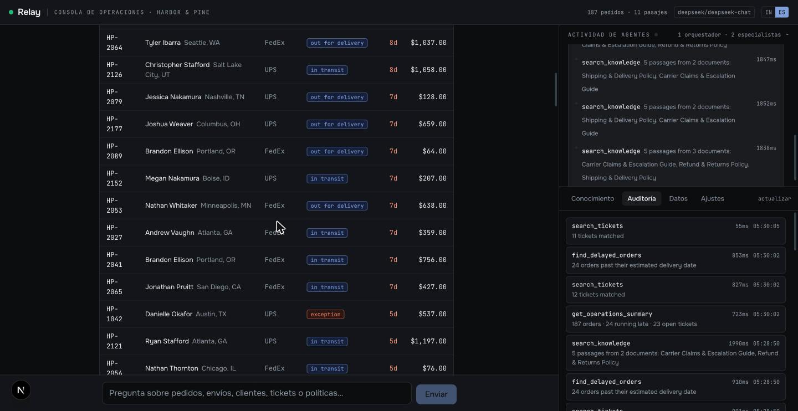

# Relay — Agente de Operaciones

**Un sistema de IA multiagente que responde con los datos operativos de la propia empresa y ejecuta acciones gobernadas con aprobación humana.**

Next.js 16 · AI SDK v7 · Claude / DeepSeek · PostgreSQL + pgvector · Embeddings locales · Autoalojado

> **Esto es un sistema de demostración, no un proyecto entregado a un cliente.** *Harbor & Pine* es una marca estadounidense ficticia y cada cliente, pedido, envío y reembolso son datos generados. La arquitectura, el código y las cifras de este documento son reales y reproducibles en la demo en vivo. La empresa no lo es.

---

## 1. Qué es

Los equipos de operaciones y soporte viven en una brecha. La respuesta a *"¿por qué no ha llegado el pedido de este cliente, y le debemos dinero?"* está en dos lugares a la vez: la base de datos de pedidos y un documento de políticas que nadie ha vuelto a leer desde la inducción. Cerrar esa brecha a mano es la mayor parte del trabajo diario de un agente de soporte.

Relay la cierra. Es una consola de chat donde el equipo pregunta en lenguaje natural y obtiene una respuesta fundamentada en ambas fuentes al mismo tiempo — la base de datos en vivo y las políticas escritas de la empresa — con el razonamiento y cada consulta subyacente visibles en pantalla.

Además actúa. Relay puede emitir un reembolso. Nunca lo hace por su cuenta: propone la acción, indica el monto, cita la política que lo justifica y espera a que un humano apruebe. Nada se mueve hasta que alguien presiona un botón.

**Lo que está viendo un comprador:** un sistema que lee sus datos reales, aplica sus reglas reales, muestra su trabajo y no puede gastar su dinero sin permiso.

---

## 2. La interfaz




*La misma conversación, más abajo: una tabla real con estados y días de retraso, generada desde "¿qué va retrasado?". Nada de esto es prosa que escribió el modelo — el frontend renderiza el resultado de la tool.*

*Una consola, tres paneles. **Izquierda:** la conversación. **Derecha, arriba:** actividad de agentes en vivo — qué especialista fue invocado, la instrucción exacta que recibió, cada tool que ejecutó y la latencia real de cada una. **Derecha, abajo:** un inspector con pestañas para la biblioteca de documentos, la bitácora de auditoría y el conjunto de datos.*

Tres decisiones deliberadas:

- **La maquinaria es visible.** Un chat que solo transmite texto es indistinguible de un envoltorio sobre un chatbot público. Mostrar `get_order → HP-1042 — fulfilled, $537.00, Danielle Okafor · 94ms` es lo que hace legible a un sistema.
- **La delegación se muestra, no se esconde.** El panel derecho nombra al especialista, cita la instrucción que recibió y anida debajo sus llamadas a tools.
- **Las escrituras están visualmente separadas.** Todo lo que modifica datos es coral, lleva la etiqueta `write` y la marca `not delegated`. En esta interfaz el color significa algo o no se usa.

---

## 3. Arquitectura de un vistazo

```
Navegador (useChat, streaming de partes de mensaje)
   │  POST /api/chat            límite de tasa por IP
   ▼
Orquestador Relay  ── posee issue_refund directamente, nunca lo delega
   │
   ├── consult_operations ──▶ Especialista de operaciones (contexto propio, 7 tools de lectura)
   │                              └──▶ PostgreSQL
   │
   ├── consult_knowledge  ──▶ Especialista de conocimiento (contexto propio, 1 tool de lectura)
   │                              └──▶ recuperación híbrida
   │                                     ├── pgvector coseno   (semántica)
   │                                     └── tsvector + BM25   (palabra clave)
   │                                     └── fusionadas por rango recíproco
   │
   └── issue_refund ──▶ COMPUERTA DE APROBACIÓN HUMANA ──▶ escritura en PostgreSQL
                                                           └──▶ bitácora de auditoría

Cada llamada a tool, de cualquier agente: entrada · resultado · estado · latencia → auditoría
```

**Un solo almacén de datos.** Las tablas de negocio y los embeddings de documentos viven en la misma instancia de PostgreSQL. Una sola cosa que operar, respaldar y explicar.

---

## 4. Los agentes

| # | Agente | Especialidad | Tools |
|---|---|---|---|
| 1 | **Relay** (orquestador) | Lee la petición, decide quién la atiende, sintetiza la respuesta, posee la ruta de escritura | 2 delegaciones + 1 escritura |
| 2 | **Especialista de operaciones** | Lo que realmente pasó: pedidos, envíos, clientes, tickets y el panorama operativo. Ventana propia. | 7 lectura |
| 3 | **Especialista de conocimiento** | Lo que dicen las reglas: políticas, umbrales, requisitos de transportistas. Contexto propio. | 1 lectura |

**Por qué separarlos.** No por velocidad — delegar cuesta latencia. Compra tres cosas: la selección de tools es mucho más confiable cuando un modelo elige entre seis tools relacionadas en lugar de catorce sin relación; el contexto de cada especialista se mantiene limpio; y la ruta de escritura queda estructuralmente aislada.

**Por qué la escritura no se delega.** `issue_refund` vive en el orquestador, donde está la compuerta de aprobación humana. Ningún especialista puede mover dinero, y ninguna cantidad de delegación puede rodear el paso de aprobación. Es una propiedad de seguridad de la topología, no un ajuste que se pueda desconfigurar.

---

## 5. Catálogo de tools

| Tool | Dueño | Efecto | Qué hace |
|---|---|---|---|
| `find_delayed_orders` | Operaciones | lectura | Pedidos que pasaron su fecha estimada de entrega y no han sido entregados |
| `search_orders` | Operaciones | lectura | Pedidos por estado, cliente o recencia |
| `get_order` | Operaciones | lectura | Un pedido completo: artículos, envío, tickets, reembolsos |
| `track_shipment` | Operaciones | lectura | Posición del envío, si va retrasado y por cuántos días |
| `search_tickets` | Operaciones | lectura | Tickets de soporte por estado, prioridad o categoría |
| `get_customer` | Operaciones | lectura | Un cliente con su historial de pedidos y tickets |
| `get_operations_summary` | Operaciones | lectura | Conteos por estado, retrasos por transportista, tendencia de 14 días |
| `search_knowledge` | Conocimiento | lectura | Recuperación híbrida sobre los documentos de la empresa |
| `issue_refund` | **Orquestador** | **escritura** | Emite un reembolso. Requiere aprobación humana. Con tope e idempotente. |

Cada tool valida su entrada con un esquema, ejecuta una consulta acotada y devuelve datos estructurados más un resumen de una línea para humanos. Al modelo se le indica que los resultados de las tools son la única fuente de verdad y que no puede inventar nada que una tool no haya devuelto.

---

## 6. Interfaz generativa

Relay no describe un pedido en prosa esperando que le crean. Cada resultado de tool se renderiza como la cosa que realmente es.

| Pregunta | Qué aparece |
|---|---|
| "¿Qué va retrasado?" | Una tabla: pedido, cliente, destino, transportista, estado, días de retraso, valor |
| "¿Qué pasó con HP-1042?" | El registro del pedido: artículos, la traza del envío con sus etapas, tickets ligados y reembolsos |
| "Dame un panorama" | Un tablero: métricas, pedidos por estado, retrasos por transportista y tendencia de 14 días |
| Una pregunta de política | Los pasajes citados, cada uno etiquetado con su documento y con qué método lo encontró |

**El modelo decide qué tool llamar. El frontend decide cómo se ve el resultado.** Esa separación importa: la salida siempre está bien formada y en marca, sin importar lo que haga el modelo, y ninguna generación mala puede romper el layout.

Las gráficas son SVG hecho a mano, no una librería, así que heredan el tema de la consola y son correctas en claro y oscuro sin una segunda paleta que mantener. Los dos colores de serie están validados para separación por daltonismo contra ambas superficies (CVD ΔE 15.5, visión normal ΔE 20.9, contraste sobre 3:1) en vez de elegidos a ojo, y cada color de estado va siempre con su etiqueta, para que la identidad nunca dependa solo del color.

## 7. Recuperación

Los documentos se suben desde la consola — PDF, Markdown o texto plano — y luego se extraen, se parten en pasajes con traslape, se vectorizan y se guardan junto a los datos de negocio.

**Los embeddings se calculan localmente**, dentro del proceso de la aplicación, con `all-MiniLM-L6-v2` a 384 dimensiones. No hay API key de embeddings, no hay costo por token, y **el contenido de un documento subido nunca sale del servidor**. Para un cliente que evalúa si entregar sus políticas internas, ese último punto suele ser el que decide.

La recuperación es híbrida, porque ningún método basta por sí solo:

- **La similitud vectorial** encuentra pasajes que significan lo mismo con otras palabras.
- **La búsqueda de texto completo de Postgres** encuentra términos exactos — un SKU, un código de transportista, un estado — que los embeddings suelen pasar por alto.
- **La fusión por rango recíproco** combina ambas. Un pasaje bien rankeado por cualquiera de los dos métodos sube; uno bien rankeado por ambos sube más. RRF no requiere calibrar puntajes entre dos sistemas incomparables, que es precisamente la razón de usarlo aquí en lugar de una mezcla ponderada.

La recuperación también es inspeccionable directamente: un panel de vista previa en la consola ejecuta la misma búsqueda que hace el agente y muestra qué pasajes salieron, cuál método encontró cada uno y cuánto tardó.

---

## 8. Cómo se siente en uso

Un intercambio real, capturado del sistema en ejecución.

**Operador:** *"Reembolsa a Danielle Okafor el pedido HP-1042 completo, el tapete se dañó en tránsito."*

1. El orquestador abre ambas líneas de investigación a la vez: *"Empezaré reuniendo los datos del pedido y la política aplicable en paralelo."*
2. Al **especialista de operaciones** se le pide el panorama completo del pedido. Ejecuta `get_order` **(94ms)** y `track_shipment` **(69ms)**, y reporta: HP-1042, surtido, $537.00, Danielle Okafor, cuatro días pasada la fecha estimada, estado del transportista `exception`.
3. Al **especialista de conocimiento** se le pregunta qué dice la política sobre daño en tránsito y cuál es el techo de aprobación. Ejecuta `search_knowledge` tres veces **(227–230ms)** sobre tres documentos.
4. El orquestador sintetiza, y detecta una distinción que nadie le pidió buscar:

   > *"Nota el matiz del retraso: el pedido lleva solo 4 días pasada la estimación, lo cual por sí solo únicamente justificaría el reembolso del cargo de envío bajo el tramo de 4 a 7 días. Pero el transportista reportó daño, así que se trata como perdido/dañado en tránsito, lo que activa el reembolso completo bajo la sección 5 sin importar el conteo de días."*

   > *"El límite de aprobación para reembolso completo es de $600 para un agente de soporte; este pedido es de $537, es decir, bajo el techo de $600, no se necesita aprobación de gerente."*

5. Se invoca `issue_refund`. **No se ejecuta.** La consola renderiza una tarjeta de confirmación: pedido HP-1042, monto $537.00, y el motivo citando la sección 5 de la Política de Envíos y Entregas y la sección 3 de la Política de Reembolsos y Devoluciones. Dos botones.
6. El operador aprueba. La tool se ejecuta en **47ms**, escribe el reembolso y registra la llamada en la bitácora de auditoría a nombre de quien aprobó.

El resultado es una decisión que a un agente de soporte le habría tomado varios minutos y dos pestañas del navegador, tomada en unos veinte segundos, con la cita de la política adjunta y un humano todavía con el dedo en el gatillo.

---

## 9. Resiliencia, seguridad y observabilidad

- **Fundamentación.** El prompt del sistema prohíbe afirmar cualquier dato que no haya devuelto una tool. A los especialistas se les instruye decir que una búsqueda no encontró nada en lugar de rellenar el hueco.
- **Ciclos acotados.** El orquestador se detiene tras 8 pasos, cada especialista tras 5. Un turno confundido no puede gastar sin límite.
- **Aprobación humana en escrituras.** Aplicada por el mecanismo de aprobación del runtime, no por una instrucción en el prompt. Un prompt se puede rodear con labia; esto no.
- **Tope de reembolso.** Un reembolso que excedería el total del pedido, menos lo ya reembolsado, es rechazado por la tool antes de llegar a la base de datos.
- **Idempotencia.** Los reembolsos llevan una llave determinista derivada del pedido, el monto y el motivo. Aprobar el mismo reembolso dos veces no hace nada, no paga dos veces.
- **Auditoría completa.** Cada llamada a tool de cada agente se registra con su entrada, su resumen de resultado, su estado y su latencia, y es legible desde la consola.
- **Límite de tasa.** Límites por IP en chat, subida y recuperación, porque una URL de demo pública es en la práctica una API key pública.
- **Validación por esquema** en cada frontera — entradas de tools, cargas de peticiones, tipos y tamaños de archivos subidos.
- **Localidad de los datos.** El contenido de los documentos subidos se vectoriza en el proceso y nunca se envía a un tercero.
- **La falla es legible.** Un error de tool devuelve un resultado tipado que el agente explica, no un 500 que deja colgada la conversación.

---

## 10. Independencia del modelo

La capa de tools, la política de aprobación y la auditoría son el sistema. El modelo es una pieza intercambiable, seleccionada por variable de entorno, con soporte actual para Anthropic Claude y DeepSeek.

Esto importa más comercialmente que técnicamente: a un cliente ya estandarizado en un proveedor no hay que sacarlo de ahí a la fuerza, y el costo por conversación se puede ajustar sin tocar la arquitectura.

---

## 11. Puesta en marcha

| # | Paso | Comando |
|---|---|---|
| 1 | Instalar dependencias | `npm install` |
| 2 | Configurar | `cp .env.example .env` — define `RELAY_PROVIDER` y la API key correspondiente |
| 3 | Levantar PostgreSQL | `npm run db:up` |
| 4 | Crear el esquema | `npm run db:push` |
| 5 | Cargar los datos de demo | `npm run db:seed` |
| 6 | Ejecutar | `npm run dev` |

El despliegue es autoalojado: un build standalone de Next.js y un contenedor de PostgreSQL detrás de un proxy inverso. No se requiere ninguna plataforma administrada ni se introduce dependencia de proveedor.

---

## 12. Qué incluye el paquete

- El código fuente completo: orquestador, especialistas, capa de tools, pipeline de recuperación, consola.
- Esquema de PostgreSQL y una semilla determinista que reproduce el mismo conjunto de datos en cada ejecución.
- El pipeline de ingesta de documentos: PDF, Markdown y texto, con vectorización local.
- El subsistema de auditoría.
- Docker Compose para desarrollo local y para el servidor.
- Este documento.

---

## 13. Qué demuestra esto

| Capacidad | Dónde verlo |
|---|---|
| Orquestación multiagente con tools acotadas | Sección 4 |
| Interfaz generativa: tablas, registros y gráficas, no prosa | Sección 6 |
| RAG en producción con recuperación híbrida | Sección 7 |
| Tool calling contra una base de datos en vivo | Sección 5 |
| Control humano sobre acciones de escritura | Secciones 8 y 9 |
| Auditabilidad y observabilidad | Sección 9 |
| Ingesta de documentos con localidad de datos | Sección 7 |
| Independencia de proveedor de modelo | Sección 10 |
| Despliegue autoalojado | Sección 11 |
